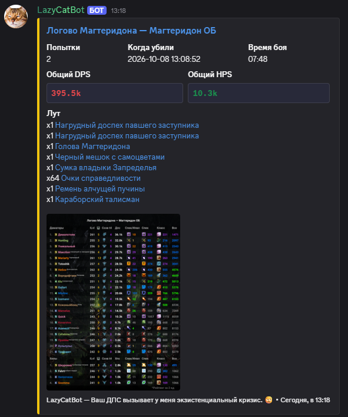
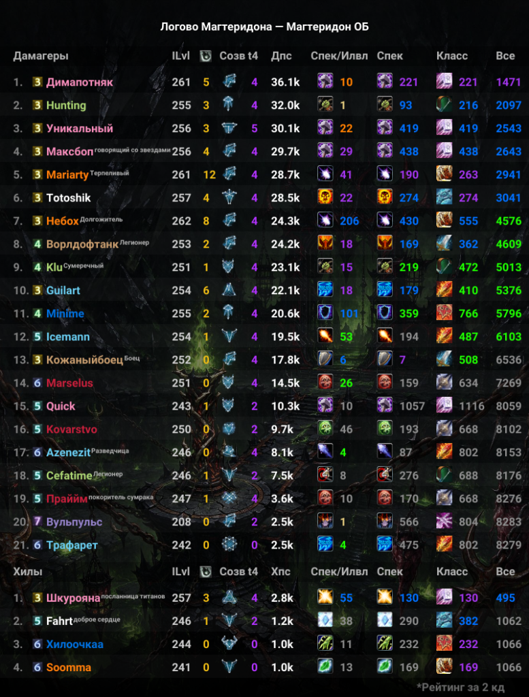
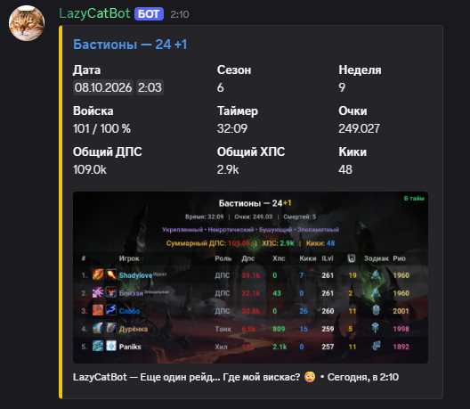
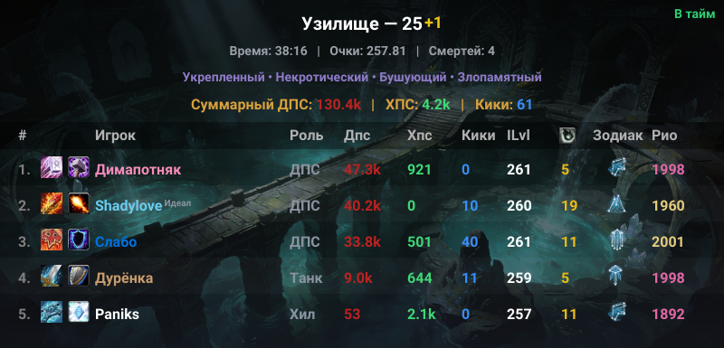

# 🐈 LazyCatBot

Дискорд-бот для отслеживания новых убийств боссов вашей гильдией, рейтингов игроков и мифик-ключей. Присылает красивые отчёты сразу после боя и формирует топы по DPS/HPS.

---

## 🚀 Как добавить и настроить

### 1. Добавление бота
Перейдите по ссылке и выберите нужный сервер:

👉 **[ДОБАВИТЬ LAZYCATBOT НА СЕРВЕР](https://discord.com/oauth2/authorize?client_id=1493704685297602731&permissions=277092879552&integration_type=0&scope=bot+applications.commands)**

> **Важно:** боту нужны права на **чтение сообщений**, **отправку сообщений** и **вставку ссылок (Embed Links)**.

### 2. Настройка канала
1. Создайте текстовый канал (например, `#raid-alerts`) и выдайте боту права на чтение и отправку сообщений в него.
2. В этом канале введите `/menu` — откроется меню с кнопками.
3. Нажмите **«🏰 Добавить гильдию»**, выберите сервер и введите ID гильдии. Аналогично можно добавить игрока через **«👤 Добавить игрока»**.
4. Бот сразу начнёт мониторинг. Если отчёт отправился — всё работает, можно в `/menu` отключить лишние типы отчётов.

> **ID гильдии** — число в конце ссылки на страницу гильдии на [sirus.su](https://sirus.su). Например, в `sirus.su/base/guilds/x3/913` ID — `913`.

---

## ✨ Возможности

### 📊 Отчёты об убийствах боссов
Бот присылает детальный отчёт сразу после убийства босса: время, сложность и основные данные боя.

### 🏆 Рейтинги игроков
Для каждого сражения формируются топы игроков гильдии по **DPS** и **HPS**.

### 🔑 Мифик-отчёты
Отслеживание мифик-подземелий с подробным отчётом о прохождении.

### 🎖 Мифик-рейтинг (Рио)
Команда `/topm` показывает мифик-рейтинг (Рио) среди участников гильдии. Кнопки можно закрепить в канале — они доступны всем.

---

## 🛠️ Команды бота

| Команда | Описание |
| :--- | :--- |
| `/menu` | Меню настройки трекинга и автоматических отчётов |
| `/top` | Меню отправки рейтингов по боссам среди игроков гильдии |
| `/topm` | Мифик-рейтинг (Рио) среди участников гильдии |
| `/list` | Список отслеживаемых гильдий в текущем канале |
| `/listcats` | Список отслеживаемых игроков в текущем канале |
| `/help` | Справка по боту |

Больше команд можно посмотреть прямо в боте — введите `/` в канале, куда добавлен бот.

---

## ❓ Часто задаваемые вопросы

**Где взять ID гильдии?**
Зайдите на сайт [Sirus.su](https://sirus.su), найдите гильдию в базе и возьмите число из конца ссылки. В `sirus.su/base/guild/x3/1234` ID — `1234`.

**Бот не присылает отчёты — что делать?**
1. Проверьте, что у бота есть права на **просмотр канала** и **отправку сообщений (Embed)**.
2. Проверьте, что отчёты включены в `/menu` — там должно быть **«Мифик: ВКЛ»** / отчёты «ВКЛЮЧЕНЫ».
3. Если бот потерял доступ к каналу, он уведомит об этом и сам удалит неактивную подписку.